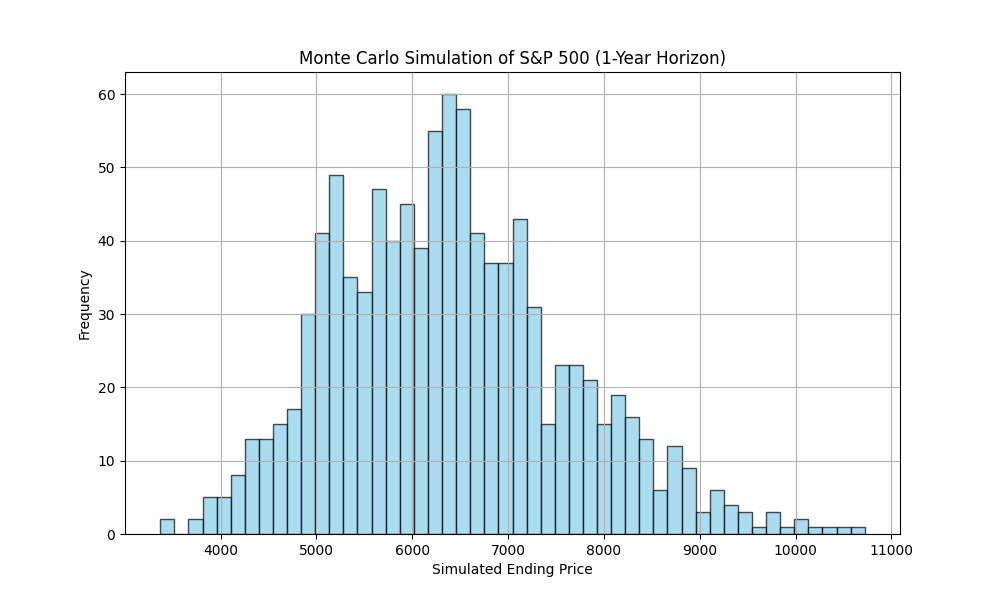

# MSDS-451-Week8-Term-Project-CheckpointC

## Introduction

This project uses Monte Carlo simulation to model potential future outcomes of the **S&P 500 index** over a one-year investment horizon. The goal is to provide a probabilistic view of market behavior, which can help investors and analysts understand risk and return expectations in uncertain environments.

### Potential Users:
- Retail investors assessing potential gains/losses
- Financial analysts managing portfolios
- AI-powered trading systems (bots, agents)
- Students/researchers in finance and quantitative modeling

The simulation can be integrated into broader risk models, portfolio optimization frameworks, or educational tools.

---

## Literature Review

Monte Carlo methods are extensively used in financial modeling:

- **RiskMetrics (J.P. Morgan)**: Applies simulation in Value-at-Risk (VaR) estimation.
- **Bodie, Kane, Marcus - *Investments***: Discusses forecasting asset prices using return distributions.
- **Hull & White (1987)**: Illustrate how volatility-driven simulations help assess asset behavior under uncertainty.
- **Black-Scholes Option Pricing**: Uses Monte Carlo for pricing derivatives.

This project builds on those foundations, applying them in a simplified Python-based framework for educational and exploratory use.

---

## Methods

### Data Retrieval
- Source: Yahoo Finance (`^GSPC` - S&P 500)
- Tool: `yfinance` Python package
- Daily `Close` prices from 2020-01-01 to 2024-12-31

### Statistical Processing
- Calculated **daily log returns**
- Computed mean return `μ ≈ 0.000526` and standard deviation `σ ≈ 0.0114`

### Monte Carlo Simulation
- Simulated **1,000 paths** over **252 trading days**
- Used:
  \[
  \text{Return}_t \sim \mathcal{N}(\mu, \sigma)
  \]
  and compounded cumulative product to simulate prices

### Visualization
- Ending prices plotted in a histogram: `simulated_prices_hist.png`

---

## Results

| Metric               | Value           |
|----------------------|------------------|
| Mean Daily Return     | ~0.000526        |
| Daily Volatility      | ~0.0114          |
| Median Ending Price   | ~$6,565          |
| 5th Percentile Price  | ~$4,300          |
| 95th Percentile Price | ~$9,400          |

- The distribution is **right-skewed**, indicating potential for significant upside with fat-tailed risk.
- The simulation captures the **uncertainty and compounding effect** of daily volatility over time.

---

## Files

- `Week8_Term_Project_CheckpointC.ipynb` — Jupyter notebook with complete code
- `simulated_prices_hist.png` — Histogram of simulated ending prices
- `Week8_Term_Project_CheckpointC.docx` — Written research report

---

## Conclusions

- Monte Carlo simulation offers a powerful framework to **forecast risk-adjusted returns** in uncertain markets.
- The wide range of possible outcomes emphasizes the importance of **volatility** in investment decisions.
- This project lays the groundwork for deeper analysis (e.g., VaR, portfolio optimization, or Sharpe ratio-based strategy evaluation).

### Limitations:
- Assumes returns are **normally distributed** and **independent** (no fat tails or volatility clustering)
- No macroeconomic or regime-based inputs (e.g., interest rates, black swan events)

---

## Next Steps

- Integrate with **portfolio-level simulations** or Value-at-Risk models
- Explore **non-normal distributions** (e.g., t-distribution, GARCH)
- Incorporate **macro factors** and **scenario-based stress testing**

---

